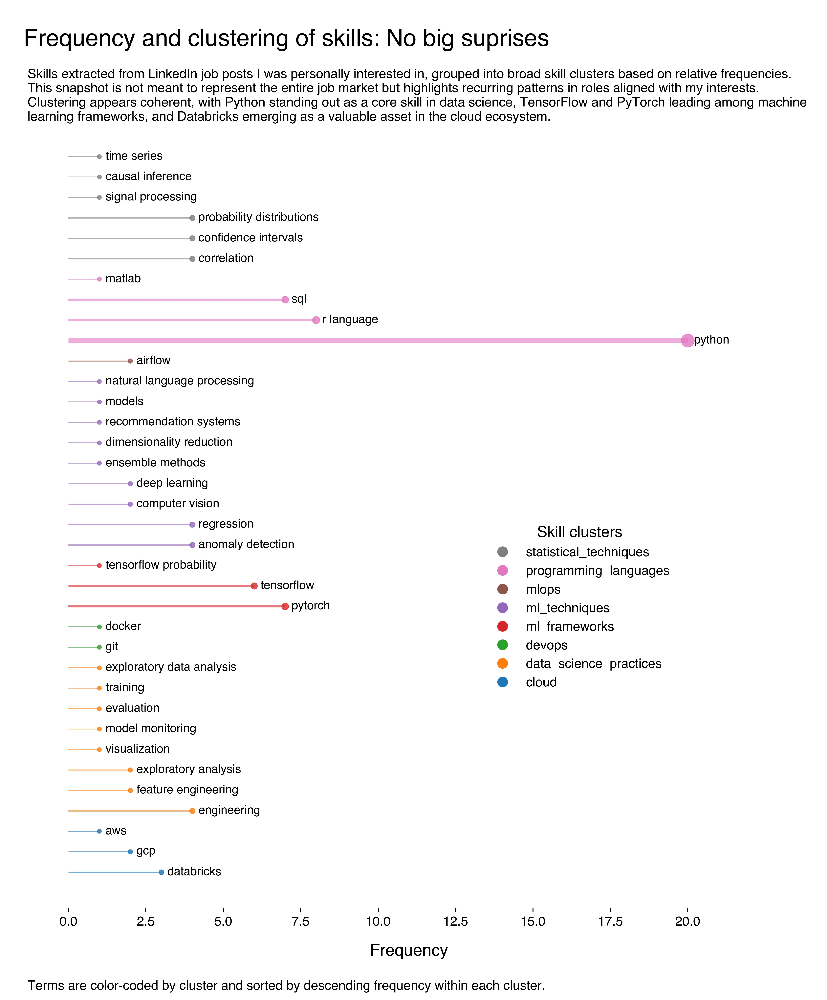

<p align="center">

</p>

# LinkedIn Job Analysis

[](https://github.com/ale-tom/linkedin-job-analysis/actions)
[](https://coveralls.io/github/ale-tom/linkedin-job-analysis?branch=main)
[](https://opensource.org/licenses/MIT)
[](https://www.python.org)
[](https://github.com/ale-tom/linkedin-job-analysis)


## Overview

This project automates the extraction of job requirements from your saved LinkedIn jobs and applies NLP-driven text analysis, hierarchical clustering and entropy-based transverasility analysis to uncover both core skill domains and the most versatile, cross‑domain tools. These insights can guide your upskilling strategy, helping you focus on high‑leverage competencies, that is those that bridge multiple job archetypes, to boost your employability and negotiation power.

The workflow is divided into two main parts:

1. **Scraping**: Log into LinkedIn, iterate through all saved-job pages, and capture each posting’s requirements, applicant count, location, and posting date.
2. **Analysis**: Analysis of the scraped data using NPMI and hierarchical clustering (with bootstrap validation) to uncover coherent data‑science skill groups and an entropy‑based transversality metric to highlight the most cross‑domain tools. Results guide upskilling priorities by revealing which competencies bridge multiple job archetypes (note that the reported analysis focusses in the Data Science sector within the U.K. market.)





## Features

- **Automated scraping** via Selenium and BeautifulSoup
- **Secure credential management** with environment variables and `python-dotenv`
- **Robust CI/CD** using GitHub Actions with pytest and flake8 linting
- **Modular code structure** for easy maintenance and extension
- **Comprehensive analysis** notebook showcasing word-frequency charts, word clouds, and entity recognition

## Getting Started

### Prerequisites

- Python 3.11.5 or higher
- Chrome browser and matching ChromeDriver
- Git

### Installation

1. Clone the repository:

   ```bash
   git clone https://github.com/<username>/linkedin-job-analysis.git
   cd linkedin-job-analysis
   ```

2. Create and activate a virtual environment:

   ```bash
   python -m venv .venv
   source .venv/bin/activate  # macOS/Linux
   .\.venv\\Scripts\\activate  # Windows
   ```

3. Install dependencies:

   ```bash
   pip install -r requirements.txt
   ```

4. Configure environment variables:

   - Create a .env file in your project root:
     ```bash
     cp .env
     ```
   - Populate `.env` with your LinkedIn credentials:
     ```dotenv
     LINKEDIN_USERNAME=your_email_or_username
     LINKEDIN_PASSWORD=your_password
     ```
   - Ensure two-factor authentication is disabled for this script.

## Usage

### Scraping Saved Jobs

Run the scraper to gather your saved-job requirements:

```bash
python src/scraper.py
```

This will generate `linkedin_job_requirements.csv` in the project root, containing:

- `job_url`
- `requirements`
- `applicant_count`
- `location`
- `date_posted`

### Data Analysis Notebook

Launch JupyterLab or Notebook:

```bash
jupyter lab
# or
jupyter notebook
```

Open `notebooks/analysis.ipynb` to explore the data-processing and visualization workflow.

## Project Structure

```text
linkedin-job-analysis/
├── .github/                 # CI workflows and issue templates
├── data/                    # Raw and processed CSVs
├── notebooks/               # Jupyter notebooks for EDA and reporting
│   └── analysis.ipynb
├── src/                     # Python modules
│   ├── scraper.py           # LinkedIn scraping logic
│   └── analysis.py          # Helper functions for NLP processing
├── tests/                   # pytest unit tests
│   └── test_scraper.py
├── assets/
│   └── clusters_freq.jpeg   # Example of output plot
├── .flake8                  # Flake8 configuration
├── requirements.txt         # Python dependencies
├── setup.py / pyproject.toml# Packaging info (optional)
└── README.md                # Project documentation
```

## Makefile

This repository includes a **Makefile** to automate common tasks. Available targets:

```bash
# Create a virtual environment (default Python from PYTHON_BIN)
make venv

# Install dependencies and set up the environment
make install

# Remove the virtual environment directory
make clean

# Run the main application script
make run

# Execute the test suite via pytest
make test

# Show help for all Makefile targets
make help
```

You can override the default Python binary when creating the virtual environment:

```bash
make venv PYTHON_BIN=/path/to/python3.9
```

## CI/CD

The GitHub Actions workflow (`.github/workflows/ci.yml`) runs on every push and pull request to the `master` branch, performing:

- Dependency installation
- Flake8 linting (`flake8 .`)
- Unit testing (`pytest --maxfail=1 --disable-warnings -q`)

## Contributing

Contributions are welcome! Please fork the repository and submit a pull request. Ensure that:

- New features include tests
- Code passes flake8 and pytest checks
- Documentation is updated in `README.md`

## License

This project is licensed under the [MIT License](LICENSE).
